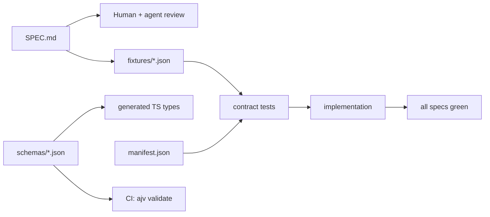

# tlush Specs — Spec-Driven Design (SDD)

This directory is the **source of truth** for the [tlush](https://github.com/ur92/get-tlush) payslip explainer. Implementation code must conform to these specs; when spec and code disagree, **the spec wins** and contract tests must fail until code is fixed.

## Core Principle

> **No implementation without a spec.** Every component defines inputs, outputs, behavior rules, and fixtures before code is written.

## Directory Layout

```
specs/
├── README.md                 # This file — SDD rules + SPEC.md template
├── constitution.md           # Fixed architectural decisions (do not change without ADR)
├── schemas/                  # JSON Schema data contracts
│   ├── canonical-payslip.schema.json
│   ├── line-item.schema.json
│   └── anonymized-record.schema.json
├── core/                     # Cross-vendor behavior specs
│   ├── parser-registry.SPEC.md
│   └── pdf-extract.SPEC.md
├── plugins/{vendor}/         # Per-vendor parser specs (Phase 0+)
│   ├── SPEC.md
│   ├── manifest.json
│   ├── codes.json
│   └── fixtures/*.json
├── calculator/               # Tax validation spec (Phase 0+)
├── explain/                  # Explanation engine spec (Phase 0+)
└── ui/                       # Hebrew RTL UI spec (Phase 0+)
```

## File Formats

| Layer | Format | Audience | Purpose |
| ----- | ------ | -------- | ------- |
| Behavior spec | `SPEC.md` | Human, agent, developer | What the system does, acceptance criteria, edge cases |
| Data contract | `*.schema.json` | Machine (CI, types) | Structure, types, constraints |
| Test data | `fixtures/*.json` | Machine (contract tests) | Golden outputs manually verified from PDFs |
| Mapping | `codes.json`, `manifest.json` | Machine | Line-code → category; fixture registry |

## SDD Rules

| Rule | Meaning |
| ---- | ------- |
| **Spec before code** | Write or update specs and fixtures before implementation |
| **Fixtures = truth** | Fixture values are written manually from source PDFs; parsers must match within tolerance |
| **Behavior change order** | PR sequence: `SPEC.md` → `manifest.json` / fixture → implementation |
| **Schema compliance** | Every fixture and parser output must validate against `schemas/canonical-payslip.schema.json` |
| **Regression** | CI runs contract tests per plugin; failures block merge |
| **New vendor** | Add `specs/plugins/{vendor}/` completely before any code in `packages/parsers/{vendor}/` |
| **Constitution is law** | Decisions in `constitution.md` require explicit review to change |

## Development Flow



## SPEC.md Template

Copy this template when creating a new behavior spec (core component, plugin, calculator, explain, or UI).

```markdown
# {Component Name} Spec

> **Status**: draft | review | approved  
> **Version**: 1.0.0  
> **Constitution**: See [constitution.md](../constitution.md) — this spec must not violate fixed decisions.

## Purpose

One paragraph: what this component does and what it does **not** do.

## Inputs

| Input | Type | Required | Source |
| ----- | ---- | -------- | ------ |
| … | … | yes/no | … |

## Outputs

| Output | Type | Schema / contract |
| ------ | ---- | ----------------- |
| … | … | `schemas/….schema.json` |

## Behavior

### Normal path

1. WHEN … THEN …
2. …

### Error handling

- WHEN … THEN throw / return …

## Acceptance Criteria

Use EARS-style criteria (WHEN / IF / WHILE / WHERE):

1. WHEN `{fixture-id}` is parsed THEN `totals.netPay` = `{value}` (±`{tolerance}`)
2. WHEN … THEN …

## Edge Cases

- …

## Non-Goals

- …

## Fixtures

| ID | PDF (gitignored) | Expected JSON | Notes |
| -- | ---------------- | ------------- | ----- |
| … | `tests/fixtures/pdf/…` | `fixtures/….json` | … |

## Dependencies

- Specs: …
- Packages: …

## Changelog

| Version | Date | Change |
| ------- | ---- | ------ |
| 1.0.0 | YYYY-MM-DD | Initial spec |
```

## Validation Commands (Phase 1+)

```bash
yarn spec:validate    # ajv on schemas + fixtures + manifest.json
yarn test:contract    # parser / explain / pipeline contract tests
yarn fixture:from-pdf # regenerate golden JSON from local PDF (see below)
```

### Local PDF fixtures (gitignored)

Place source payslips under `tests/fixtures/pdf/` for parse contract tests and fixture regeneration:

| Source file | Copy to |
| ----------- | ------- |
| `FileDownload (8).pdf` | `tests/fixtures/pdf/hilan-april-2026.pdf` |
| `123.pdf` | `tests/fixtures/pdf/merkava-march-2026.pdf` |
| `תלוש-משכורת-שיקלולית.pdf` | `tests/fixtures/pdf/hilan-shiklolit.pdf` |

Regenerate committed golden JSON after parser changes:

```bash
yarn fixture:from-pdf -- --vendor hilan --id april-2026 \
  --pdf tests/fixtures/pdf/hilan-april-2026.pdf \
  --out specs/plugins/hilan/fixtures/april-2026.json
```

## Agent & IDE rules

- [AGENTS.md](../AGENTS.md) — entry point for coding agents
- [.cursor/rules/spec-driven-design.mdc](../.cursor/rules/spec-driven-design.mdc) — Cursor rule (always apply)

## Related Documents

- [constitution.md](./constitution.md) — fixed project decisions
- [core/parser-registry.SPEC.md](./core/parser-registry.SPEC.md) — plugin detection and dispatch
- [core/pdf-extract.SPEC.md](./core/pdf-extract.SPEC.md) — PDF text extraction contract
