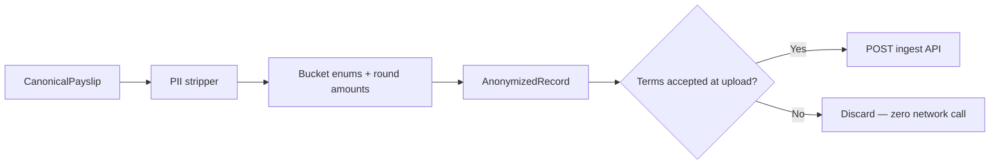

# Analytics Spec

Opt-in anonymous salary observations for aggregate Israeli salary statistics. Security and anonymization are first-class.

## Purpose

After successful payslip parse, send **anonymized metrics** to a concealed Netlify Function ingest API — only if the user accepted Terms at upload. Never send PDF bytes, PII, or raw payslip labels.

**Production only (MVP):** ingest runs only when the SPA is served from `gettlush.netlify.app`. `next` branch deploys, PR previews, and localhost skip analytics unless `VITE_ANALYTICS_INGEST_URL` is set for local testing — avoids polluting Supabase with staging data.

**Local dev bypass:** when `VITE_DEV_NO_AUTH=true` and Vite `DEV` is true (`specs/auth/SPEC.md`), analytics is always disabled — no ingest POST even if `VITE_ANALYTICS_INGEST_URL` is set.

## Principles (non-negotiable)

| Rule | Implementation |
| ---- | -------------- |
| Terms at upload | Checkbox on upload form — default **checked**; parse blocked if unchecked |
| No raw PDF | PDF never leaves browser |
| Anonymize before send | `packages/analytics/anonymize()` runs client-side |
| No PII in DB | Deny-list enforced client + ingest handler |
| Concealed API | Netlify Function `a` at `/.netlify/functions/a`; production URL hardcoded in client when hostname is `gettlush.netlify.app` |
| Encrypt everywhere | TLS 1.2+ in transit; Supabase Postgres encryption at rest |
| No WAF (MVP) | Netlify Function timeout + per-contributor dedup only |
| Purpose limitation | Aggregated statistics only — documented in `specs/legal/TERMS.md` |

## Pipeline



Trigger: `submitObservation()` runs automatically after parse **only if** terms checkbox was checked for that upload session. No second consent step.

## PII deny-list

Fields and patterns **never** sent to API or stored in Postgres. Stripped client-side; ingest handler rejects if present.

| Category | Denied fields / patterns |
| -------- | ------------------------ |
| Identity | `employee.name`, `employee.id`, `ת.ז.`, national ID, passport |
| Contact | email, phone, address |
| Banking | bank name, branch, account number |
| Employer | `employer.name`, site address, manager names |
| Payslip metadata | payslip serial (`DB-…`), internal employee numbers |
| Auth | Google `sub`, email, `id_token` payload fields |
| Raw text | `rawLabel`, Hebrew line labels, free-text job titles |
| Equity identifiers | ticker, grant ID, share count, vesting schedule dates |

**Allowed**: bucketed enums (`sector`, `seniority_band`, `role_family`), rounded/banded amounts, vendor id, period, category sums.

## AnonymizedRecord (client payload)

**Contract:** [`specs/schemas/anonymized-record.schema.json`](../schemas/anonymized-record.schema.json) — implementation in `packages/analytics/src/anonymize.ts` must produce objects that pass ajv validation.

Required fields: `recordId`, `recordedAt`, `appVersion`, `vendorId`, `period`, `totals`, `categoryCounts`, `flags`, `userConsent: true`.

Optional: `context`, `parseQuality`, `validation`, `details` (agile extension), `sessionHash`, `parserVersion`, `detectionConfidence`.

`contributor_token` is **not** sent by client — ingest handler derives it server-side when writing to Supabase.

## `details` map (agile extension)

Fixed `metrics` for indexed queries; evolving observability in `details`:

### Tax & social

| Key | Type | Notes |
| --- | ---- | ----- |
| `tax_credit_zikui_gemel` | number | Pension tax credit if parsed |
| `estimated_marginal_rate_band` | string | e.g. `20%`, `31%` |
| `ni_employer` | number | If parsed |
| `ni_adjustment_flag` | boolean | הפרשי ביטוח לאומי present |

### Savings

| Key | Type |
| --- | ---- |
| `pension_savings_rate_band` | string |
| `keren_hishtalmut_employee` | number |
| `keren_hishtalmut_employer` | number |

### Equity — vesting

| Key | Type |
| --- | ---- |
| `has_rsu_vesting` | boolean |
| `rsu_vesting_tax_bucket` | string |
| `rsu_vesting_proceeds_bucket` | string |

### Equity — RSU sale (required for MVP schema)

| Key | Type | Notes |
| --- | ---- | ----- |
| `has_rsu_sale` | boolean | Proceeds deposited after sell |
| `rsu_sale_tax_bucket` | string | **Tax withheld after RSU sell** |
| `rsu_sale_proceeds_bucket` | string | Sale proceeds (banded) |
| `rsu_effective_tax_rate_band` | string | `sale_tax ÷ proceeds`, banded |

### Equity — other

| Key | Type |
| --- | ---- |
| `has_espp` | boolean |
| `equity_event_types` | string[] | `vesting` \| `sale` \| `correction` \| `espp` |

### YTD & categories

| Key | Type |
| --- | ---- |
| `ytd_income_tax` | number |
| `ytd_ni` | number |
| `ytd_gross` | number |
| `category_sums.*` | number | Totals by `LineItem.category` — never raw labels |

### Amount banding

Round or bucket sensitive amounts before send (e.g. nearest ₪100 for equity buckets). Exact core totals (`gross_cash`, `net_pay`) may remain precise for validation aggregates.

## Supabase schema: `salary_observations`

Migration: [`infra/supabase/001_salary_observations.sql`](../../infra/supabase/001_salary_observations.sql)

| Column | Type | Notes |
| ------ | ---- | ----- |
| `record_id` | UUID | PK — client `recordId` |
| `period_year` | INT | Partition key candidate |
| `period_month` | INT | 1–12 |
| `vendor_id` | TEXT | `hilan` \| `merkava` \| `unknown` |
| `gross_cash` | NUMERIC | Core metric |
| `taxable_gross` | NUMERIC | |
| `net_pay` | NUMERIC | |
| `income_tax` | NUMERIC | |
| `ni` | NUMERIC | |
| `health_tax` | NUMERIC | |
| `pension_employee` | NUMERIC | Optional |
| `has_equity` | BOOLEAN | From `context.hasEquity` |
| `details` | JSONB | Agile extension map |
| `optional_context` | JSONB | Enum bands only (`context`) |
| `category_counts` | JSONB | Line-item category histogram |
| `flags` | JSONB | Observation flags array |
| `app_version` | TEXT | Client semver |
| `recorded_at` | TIMESTAMPTZ | Client timestamp |
| `contributor_token` | TEXT | `HMAC-SHA256(secret, sub)` — abuse prevention, not PII |
| `core_hash` | TEXT | Dedup key over core totals |
| `ingested_at` | TIMESTAMPTZ | Server write time |

**Unique index:** `(contributor_token, period_year, period_month, core_hash)` — idempotency / duplicate rejection (409).

**Encryption at rest:** Supabase managed Postgres encryption.

## Concealed ingest API

```
POST https://gettlush.netlify.app/.netlify/functions/a
Authorization: Bearer {Google id_token}
Content-Type: application/json

Body: AnonymizedRecord
```

| Control | Purpose |
| ------- | ------- |
| OIDC JWT validation | Handler validates Google `id_token` via JWKS |
| Fixed short function name | `a` — not linked in public UI; reduces casual discovery |
| Function timeout | 10 s max (`netlify.toml`) |
| Per-contributor dedup | Unique index on contributor + period + core hash |
| Payload size cap | Reject bodies > 8 KB |
| Schema validation | Against `anonymized-record.schema.json` |
| PII deny-list scan | Handler rejects forbidden keys |
| Idempotency | Same contributor + period + core hash → 409 Conflict |

**Do not** document ingest URL in public README. Production client resolves ingest URL from hostname (`gettlush.netlify.app`); optional `VITE_ANALYTICS_INGEST_URL` env override for local ingest testing only.

### Contributor token (server-side)

```
contributor_token = HMAC-SHA256(CONTRIBUTOR_TOKEN_SECRET, google_sub)
```

- `sub` and email discarded after token derivation
- Token used only for dedup/rate-limit — not linkable to identity without secret

## MVP backend components

| Component | Role |
| --------- | ---- |
| Netlify static CDN | SPA hosting (`packages/web/dist`) |
| Netlify Function `a` | JWT validate, schema validate, PII scan, Supabase write |
| Supabase Postgres | `salary_observations` table |
| `packages/ingest` | Shared handler logic (tested via contract tests) |

**Environment variables (production context only in Netlify UI):**

| Variable | Purpose |
| -------- | ------- |
| `CONTRIBUTOR_TOKEN_SECRET` | HMAC key for contributor token |
| `SUPABASE_URL` | Supabase project URL |
| `SUPABASE_SERVICE_ROLE_KEY` | Server-side write access |
| `GOOGLE_CLIENT_ID` | JWT audience validation |

## Acceptance criteria

1. WHEN terms checkbox unchecked at upload THEN `submitObservation()` is never called.
2. WHEN terms accepted AND parse succeeds THEN anonymized POST sent with Bearer `id_token`.
3. WHEN payload contains any PII deny-list field THEN client stripper removes it; handler returns 400 if any remain.
4. WHEN RSU sale lines parsed THEN `details.has_rsu_sale`, `details.rsu_sale_tax_bucket`, `details.rsu_sale_proceeds_bucket` populated.
5. WHEN ingest succeeds THEN Supabase row has `period_year`, `period_month`, `contributor_token`, encrypted at rest.
6. WHEN same user resubmits same period with same core totals THEN handler returns 409.
7. WHEN ingest URL unavailable (non-production host and no dev override) THEN client skips analytics silently (no throw).
8. WHEN `VITE_DEV_NO_AUTH=true` and Vite `DEV` is true THEN client skips analytics silently even if `VITE_ANALYTICS_INGEST_URL` is set.
9. WHEN handler logs errors THEN no raw request body or PII fields logged.
10. WHEN `userConsent` is not `true` THEN handler returns 400.

## Contract tests

```
tests/contract/analytics.test.ts
  → anonymize(fixture Payslip) contains no deny-list keys
  → RSU sale fixture populates details.rsu_sale_tax_bucket
  → terms=false → submitObservation not invoked (mock fetch)

tests/contract/ingest.test.ts
  → valid record → 201
  → PII field → 400
  → bad JWT → 401
  → duplicate contributor+period+hash → 409
  → userConsent !== true → 400
```

## Future (Phase 6+)

- k-anonymity thresholds before public dashboard
- Scheduled rollups → Parquet / analytics warehouse
- Optional WAF if abuse appears
- Analytics on staging with separate Supabase project if needed
