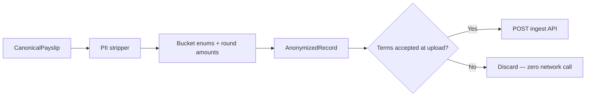

# Analytics Spec

Opt-in anonymous salary observations for aggregate Israeli salary statistics. Security and anonymization are first-class.

## Purpose

After successful payslip parse, send **anonymized metrics** to a concealed AWS ingest API — only if the user accepted Terms at upload. Never send PDF bytes, PII, or raw payslip labels.

## Principles (non-negotiable)

| Rule | Implementation |
| ---- | -------------- |
| Terms at upload | Checkbox on upload form — default **checked**; parse blocked if unchecked |
| No raw PDF | PDF never leaves browser |
| Anonymize before send | `packages/analytics/anonymize()` runs client-side |
| No PII in DB | Deny-list enforced client + Lambda |
| Concealed API | Non-guessable path; URL via `VITE_ANALYTICS_INGEST_URL` at build time only |
| Encrypt everywhere | TLS 1.2+ in transit; DynamoDB SSE-KMS at rest |
| No WAF (MVP) | API Gateway throttling + Lambda rate limits only |
| Purpose limitation | Aggregated statistics only — documented in `specs/legal/TERMS.md` |

## Pipeline



Trigger: `submitObservation()` runs automatically after parse **only if** terms checkbox was checked for that upload session. No second consent step.

## PII deny-list

Fields and patterns **never** sent to API or stored in DynamoDB. Stripped client-side; Lambda rejects if present.

| Category | Denied fields / patterns |
| -------- | ------------------------ |
| Identity | `employee.name`, `employee.id`, `ת.ז.`, national ID, passport |
| Contact | email, phone, address |
| Banking | bank name, branch, account number |
| Employer | `employer.name`, site address, manager names |
| Payslip metadata | payslip serial (`DB-…`), internal employee numbers |
| Auth | Google `sub`, email, `id_token` payload fields |
| Raw text | `rawLabel`, Hebrew line labels, free-text job titles |
| Equity identifiers | ticker, grant ID, share count, vesting schedule dates |

**Allowed**: bucketed enums (`sector`, `seniority_band`, `role_family`), rounded/banded amounts, vendor id, period, category sums.

## AnonymizedRecord (client payload)

**Contract:** [`specs/schemas/anonymized-record.schema.json`](../schemas/anonymized-record.schema.json) — implementation in `packages/analytics/src/anonymize.ts` must produce objects that pass ajv validation.

Required fields: `recordId`, `recordedAt`, `appVersion`, `vendorId`, `period`, `totals`, `categoryCounts`, `flags`, `userConsent: true`.

Optional: `context`, `parseQuality`, `validation`, `details` (agile extension), `sessionHash`, `parserVersion`, `detectionConfidence`.

`contributor_token` is **not** sent by client — Lambda derives it server-side when writing to DynamoDB.

## `details` map (agile extension)

Fixed `metrics` for indexed queries; evolving observability in `details`:

### Tax & social

| Key | Type | Notes |
| --- | ---- | ----- |
| `tax_credit_zikui_gemel` | number | Pension tax credit if parsed |
| `estimated_marginal_rate_band` | string | e.g. `20%`, `31%` |
| `ni_employer` | number | If parsed |
| `ni_adjustment_flag` | boolean | הפרשי ביטוח לאומי present |

### Savings

| Key | Type |
| --- | ---- |
| `pension_savings_rate_band` | string |
| `keren_hishtalmut_employee` | number |
| `keren_hishtalmut_employer` | number |

### Equity — vesting

| Key | Type |
| --- | ---- |
| `has_rsu_vesting` | boolean |
| `rsu_vesting_tax_bucket` | string |
| `rsu_vesting_proceeds_bucket` | string |

### Equity — RSU sale (required for MVP schema)

| Key | Type | Notes |
| --- | ---- | ----- |
| `has_rsu_sale` | boolean | Proceeds deposited after sell |
| `rsu_sale_tax_bucket` | string | **Tax withheld after RSU sell** |
| `rsu_sale_proceeds_bucket` | string | Sale proceeds (banded) |
| `rsu_effective_tax_rate_band` | string | `sale_tax ÷ proceeds`, banded |

### Equity — other

| Key | Type |
| --- | ---- |
| `has_espp` | boolean |
| `equity_event_types` | string[] | `vesting` \| `sale` \| `correction` \| `espp` |

### YTD & categories

| Key | Type |
| --- | ---- |
| `ytd_income_tax` | number |
| `ytd_ni` | number |
| `ytd_gross` | number |
| `category_sums.*` | number | Totals by `LineItem.category` — never raw labels |

### Amount banding

Round or bucket sensitive amounts before send (e.g. nearest ₪100 for equity buckets). Exact core totals (`gross_cash`, `net_pay`) may remain precise for validation aggregates.

## DynamoDB schema: `salary_observations`

| Attribute | Type | Key | Notes |
| --------- | ---- | --- | ----- |
| `pk` | S | HASH | `OBS#{year}#{month}` |
| `sk` | S | RANGE | ULID — unique observation |
| `vendor` | S | | GSI candidate |
| `gross_cash` | N | | Core metric |
| `taxable_gross` | N | | |
| `net_pay` | N | | |
| `income_tax` | N | | |
| `ni` | N | | |
| `health_tax` | N | | |
| `pension_employee` | N | | Optional |
| `keren_hishtalmut_employee` | N | | Optional |
| `credit_points` | N | | Optional |
| `has_equity` | BOOL | | |
| `details` | M | | DynamoDB Map — includes RSU sale tax fields |
| `optional_context` | M | | Enum bands only |
| `contributor_token` | S | GSI | `HMAC(KMS_secret, sub)` — abuse prevention, not PII |
| `ingested_at` | S | | ISO 8601 |
| `ttl` | N | | Optional retention (e.g. 7 years) |

**Encryption at rest**: SSE-KMS with dedicated CMK (`alias/get-tlush-analytics`).

**GSI**: `contributor_token-index` (KEYS_ONLY) for rate-limit / dedup lookups.

## Concealed ingest API

```
POST https://{api-id}.execute-api.{region}.amazonaws.com/{stage}/{random-path-segment}
Authorization: Bearer {Google id_token}
Content-Type: application/json

Body: AnonymizedRecord
```

| Control | Purpose |
| ------- | ------- |
| OIDC JWT validation | Lambda validates Google `id_token` |
| Non-guessable path | Reduces drive-by scraping (additive, not sole defense) |
| API Gateway throttling | Per-stage rate/burst limits |
| Lambda rate limit | Per-`contributor_token` cap via conditional write |
| Payload size cap | Reject bodies > 8 KB |
| Schema validation | Against `anonymized-record.schema.json` |
| PII deny-list scan | Lambda rejects forbidden keys |
| Idempotency | Same contributor + period + core hash → upsert or reject |

**Do not** document ingest URL in public README or source comments. Inject via `VITE_ANALYTICS_INGEST_URL` at CI build time.

### Contributor token (server-side)

```
contributor_token = HMAC-SHA256(KMS_derived_secret, google_sub)
```

- `sub` and email discarded after token derivation
- Token used only for dedup/rate-limit — not linkable to identity without KMS secret

## AWS components (MVP)

| Service | Role |
| ------- | ---- |
| API Gateway HTTP API | TLS termination, throttling (**no WAF**) |
| Lambda (Node 20) | JWT validate, schema validate, PII scan, DynamoDB write |
| DynamoDB on-demand | `salary_observations` table |
| KMS CMK | Table encryption + HMAC secret |
| CloudWatch | Lambda errors only — **no payslip/metric content in logs** |

## Acceptance criteria

1. WHEN terms checkbox unchecked at upload THEN `submitObservation()` is never called.
2. WHEN terms accepted AND parse succeeds THEN anonymized POST sent with Bearer `id_token`.
3. WHEN payload contains any PII deny-list field THEN client stripper removes it; Lambda returns 400 if any remain.
4. WHEN RSU sale lines parsed THEN `details.has_rsu_sale`, `details.rsu_sale_tax_bucket`, `details.rsu_sale_proceeds_bucket` populated.
5. WHEN ingest succeeds THEN DynamoDB item has `pk=OBS#{year}#{month}`, encrypted at rest with KMS.
6. WHEN same user resubmits same period THEN idempotency rule applies (upsert or 409).
7. WHEN ingest URL missing from env THEN client skips analytics silently (no throw).
8. WHEN CloudWatch logs written THEN no raw request body or PII fields logged.

## Contract tests

```
tests/contract/analytics.test.ts
  → anonymize(fixture Payslip) contains no deny-list keys
  → RSU sale fixture populates details.rsu_sale_tax_bucket
  → terms=false → submitObservation not invoked (mock fetch)
```

## Future (Phase 6+)

- k-anonymity thresholds before public dashboard
- Scheduled rollups → S3/Parquet → Athena
- Optional WAF if abuse appears
- Field-level KMS envelope encryption on `details` if regulatory review requires
