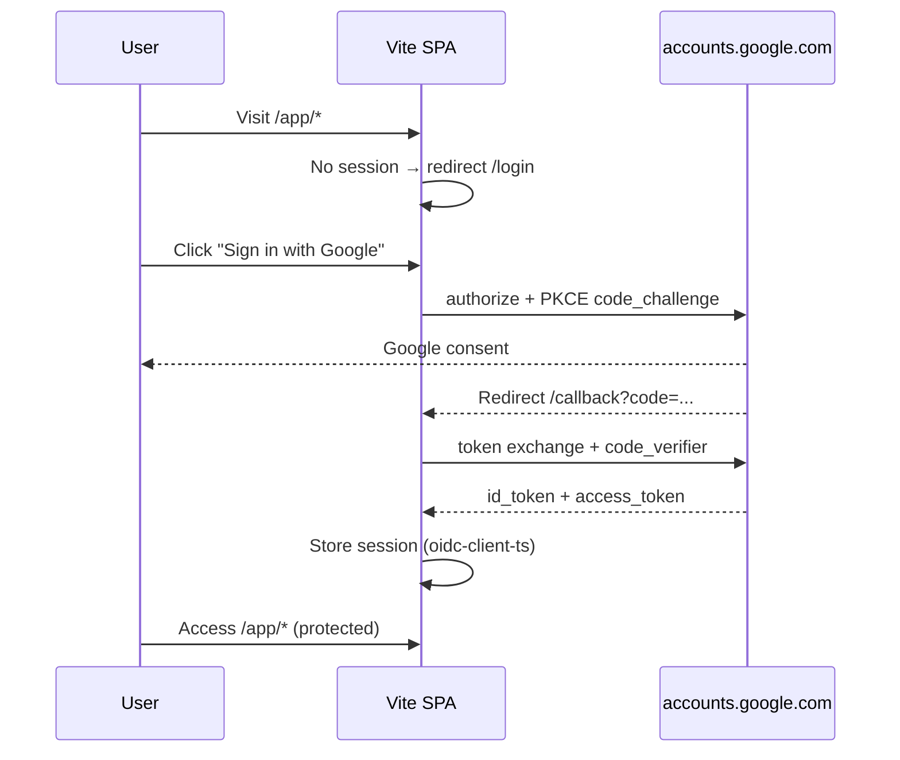

# Authentication Spec

Direct Google OIDC for SPA — Authorization Code + PKCE. No Cognito, no custom password auth.

## Purpose

Gate access to `/app/*` routes. Payslip PDFs and parsed data remain client-side only; auth does not upload payslip content.

## Stack

| Component | Choice |
| --------- | ------ |
| Protocol | OpenID Connect (OIDC) |
| Flow | Authorization Code + PKCE (public client) |
| IdP | Google (`https://accounts.google.com`) |
| SPA library | [`react-oidc-context`](https://github.com/authts/react-oidc-context) + `oidc-client-ts` |
| Package | `packages/auth/` — `OidcProvider`, `useAuth`, config |

## Environment variables

| Variable | Required | Example |
| -------- | -------- | ------- |
| `VITE_GOOGLE_CLIENT_ID` | yes | `123456789.apps.googleusercontent.com` |
| `VITE_OIDC_REDIRECT_URI` | yes | `https://app.example.com/callback` |

No client secret in the browser (public SPA client).

## Google Cloud setup

OAuth 2.0 Client ID (Web application):

- **Authorized JavaScript origins**: production domain, `http://localhost:5173`
- **Authorized redirect URIs**: `{origin}/callback` for each origin
- Scopes: `openid email profile`

## OIDC configuration

```typescript
// packages/auth/src/oidc-config.ts
import type { AuthProviderProps } from 'react-oidc-context';

export const oidcConfig: AuthProviderProps = {
  authority: 'https://accounts.google.com',
  client_id: import.meta.env.VITE_GOOGLE_CLIENT_ID,
  redirect_uri: import.meta.env.VITE_OIDC_REDIRECT_URI,
  response_type: 'code',
  scope: 'openid email profile',
  automaticSilentRenew: true,
};
```

## Auth flow



## Routes

| Path | Access | Behavior |
| ---- | ------ | -------- |
| `/` | public | Marketing / redirect to login or app |
| `/login` | public | "Sign in with Google" button |
| `/callback` | public | OIDC redirect handler; completes sign-in |
| `/app/*` | **protected** | Requires valid OIDC session; else redirect `/login` |
| `/terms` | public | Terms & Privacy (`specs/legal/TERMS.md`) |

## Protected route guard

```typescript
// Pseudocode — apps/web/src/routes/ProtectedRoute.tsx
function ProtectedRoute({ children }) {
  const auth = useAuth();
  if (auth.isLoading) return <Loading />;
  if (!auth.isAuthenticated) return <Navigate to="/login" />;
  return children;
}
```

Wrap all `/app/*` routes (upload, summary, waterfall, breakdown).

## Session management

- Tokens stored by `oidc-client-ts` (sessionStorage or configured store)
- `automaticSilentRenew: true` — refresh before expiry
- Sign out: `auth.removeUser()` + redirect `/login`
- User identity: Google `sub` from `id_token` (stable; used only client-side for analytics Bearer token — never stored server-side)

## Privacy boundary

| Data | Location |
| ---- | -------- |
| Credentials | Google only |
| OIDC tokens | Browser session |
| Payslip PDF | Browser only — never uploaded |
| Parsed payslip | Browser only |
| Analytics | Anonymized metrics only (`specs/analytics/SPEC.md`) |

## Acceptance criteria

1. WHEN unauthenticated user visits `/app/upload` THEN redirect to `/login`.
2. WHEN user completes Google OIDC flow THEN `/callback` establishes session and redirects to `/app/upload`.
3. WHEN authenticated user visits `/app/*` THEN page renders without redirect.
4. WHEN user signs out THEN session cleared and `/app/*` redirects to `/login`.
5. WHEN `VITE_GOOGLE_CLIENT_ID` or `VITE_OIDC_REDIRECT_URI` is missing THEN build fails or app shows configuration error (no silent fallback).
6. WHEN token expires AND silent renew fails THEN redirect to `/login`.
7. WHEN `id_token` is sent to analytics ingest THEN used only as Bearer for JWT validation; Lambda discards `sub` after deriving `contributor_token`.

## Future: additional IdP (Phase 5+)

Not MVP. When needed, choose one path and document in this spec:

1. **Multi-IdP in app** — separate OIDC config per provider + provider picker UI
2. **Broker** — migrate to Cognito/Auth0 for single issuer URL

## Implementation packages

- `packages/auth/` — config, `AuthProvider` wrapper, `useAuth` hook
- `apps/web/src/routes/` — `LoginPage`, `CallbackPage`, `ProtectedRoute`
- No `infra/cognito/` — Google OAuth client only
